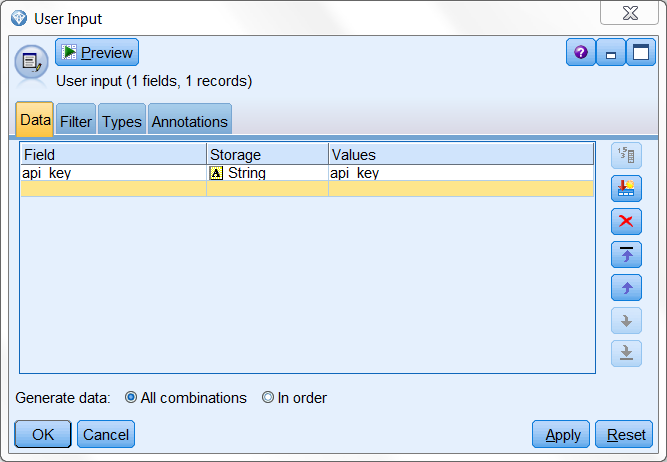
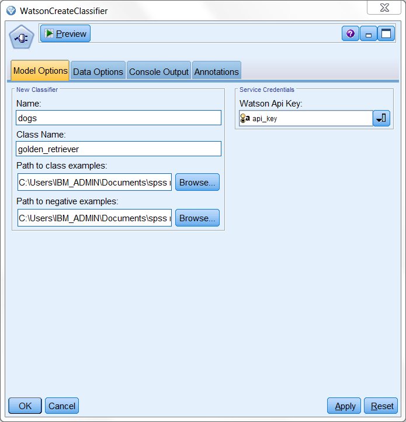
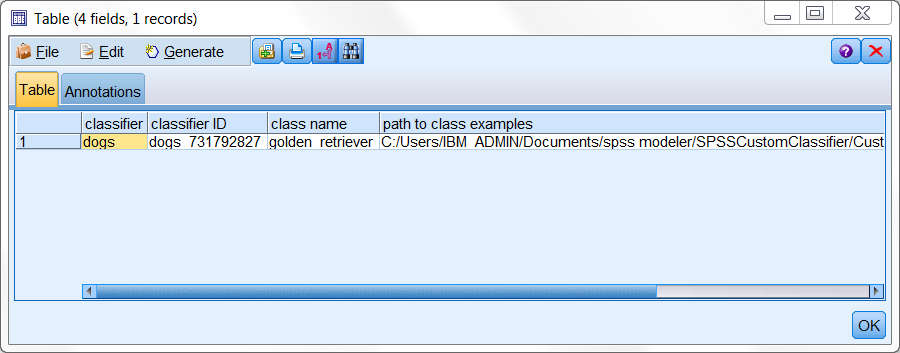

# Create your custom image classifier for Watson Visual Recognition service

This extension enables you to create your own custom image classifiers 

  

service demo:
https://visual-recognition-demo.mybluemix.net/train

# Example usage
## Creating classifier

Example stream

  

WatsonCreateClassifier node requires a connected source with your unique 'api_key' for bluemix services.

  

	
In the main node window chose your 'api_key' for the 'Watson Api Key' field. Next provide 'Name', 'Class Name' and choose zip file that contains examples representing your 'Class Name'. These will be used to teach the classifier what to look for. Finally in the last remaining field provide zip file with some examples representing the opposite of your 'Class Name'. 

Negative examples are not stored as new classes, but are equally important for training!

  

	
	
# Output

The generated output is a table that contains:
- the classifier name
- it's id assigned by the Watson
- name of the new class
- path to files that were used for training that class

If you wish to use your new classifier in other nodes save the 'classifier ID'!

  

You can test how well your classifier works using the ['WatsonVisualRecognition'][2] extension!

# License
- [Apache 2.0][1]

# Contributors
- Artur Kucia

 [1]: http://www.apache.org/licenses/LICENSE-2.0.html
 [2]: https://github.com/SpssModelerExtensions/WatsonVisualRecognition
