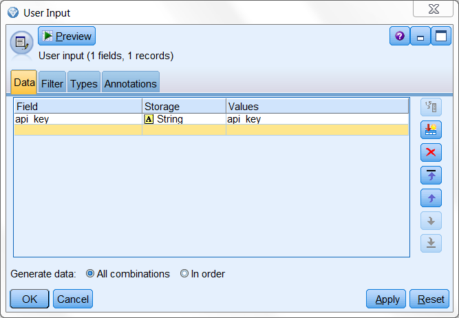
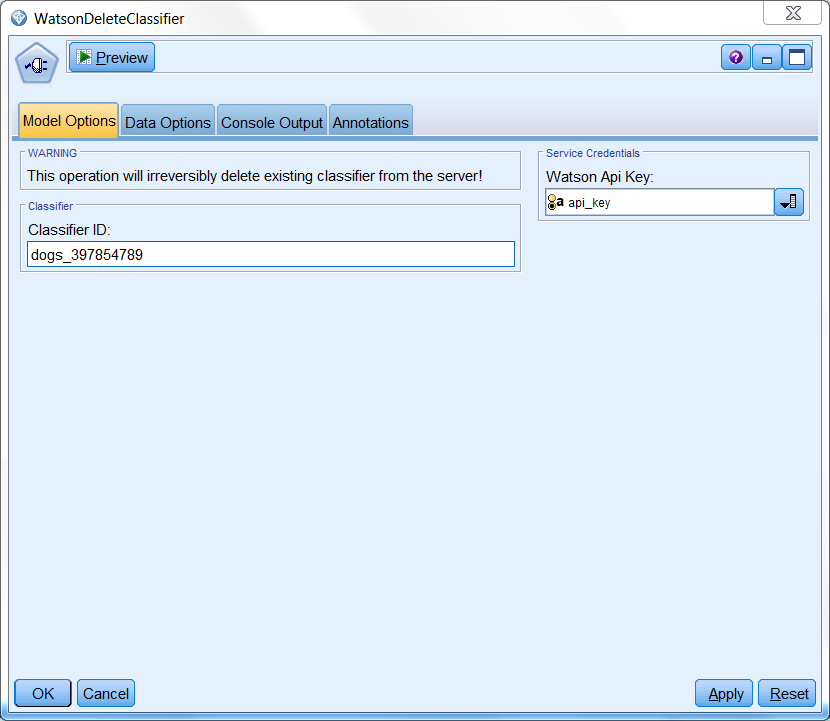
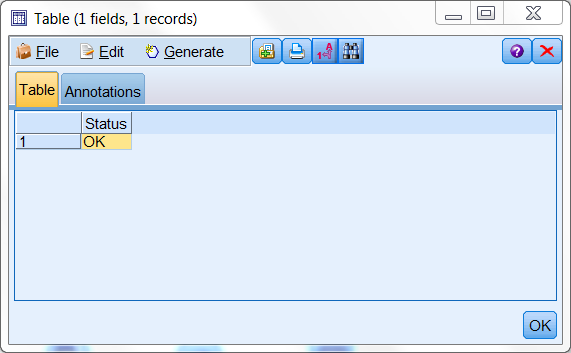

# Delete your custom image classifier for Watson Visual Recognition service

This extensions enables you to delete your custom classifiers.

  

service demo:
https://visual-recognition-demo.mybluemix.net/train

# Example usage

Example stream

  

WatsonDeleteClassifier node requires a connected source with your 'api_key' for bluemix services. 

  

In the WatsonDeleteClassifier's main window provide the id of the classifier and connect the 'api_key' from the 'user input' node.

  

	
	
# Output

The generated output will inform you whether the operation was successful.

  

You can train new classifiers with ['WatsonCreateClassifier'][2] extension!

# License
- [Apache 2.0][1]

# Contributors
- Artur Kucia

 [1]: http://www.apache.org/licenses/LICENSE-2.0.html
 [2]: https://github.com/SpssModelerExtensions/WatsonCreateClassifier
