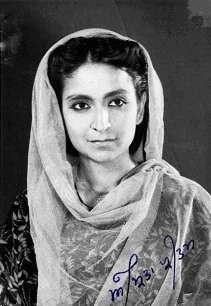
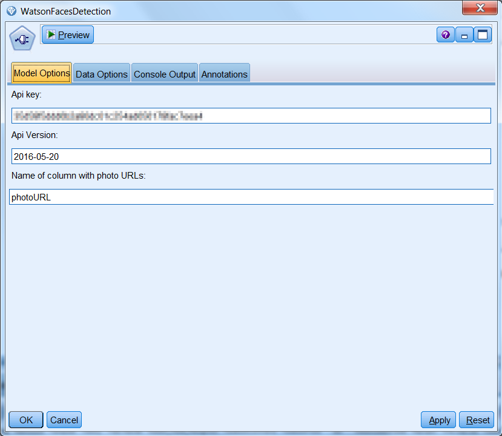
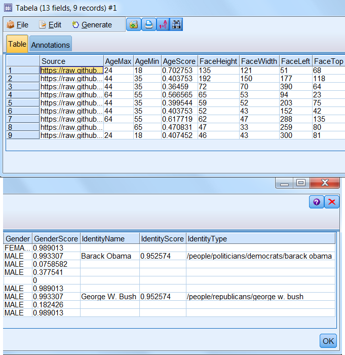

### Detect faces with Watson Visual Recognition

  

This SPSS Modeler Node allows you to gather information about people on input photos. Watson Visual Recognition will try to detect where are any faces on photo, age and gender of person whose face it is, and sometime his/her identity.

### Example stream

WatsonFacesDetection node requires a connected source node. In this example, we are using "Excel" source node with one column - "photoURL".

  

Photos used in this example (on public domain from [commons.wikimedia.org](https://commons.wikimedia.org/))

  
  
  

In the node window you must provide the **api key** that you received earlier and a **name of column** in which SPSS Modeler can find photo URLs.
You can also change **Api version** if needed (for more information, you can read Visual Recognition's [API Reference](https://www.ibm.com/watson/developercloud/visual-recognition/api/v3/#detect_faces)).

  

### Output

The generated output contains:
* source URL of photo
* information about age with score (score's value is between 0 and 1)
* face size (height and width of rectangle containing photo)
* face position (top-left pixel position of rectangle containing photo)
* gendender and it's score (score's value is between 0 and 1)
* identity name with score - Watson Visual Recognition may recognize person from photo
* identity type is information where recognized person belongs (in example /people/politicians/**IDENTITY**)

  

